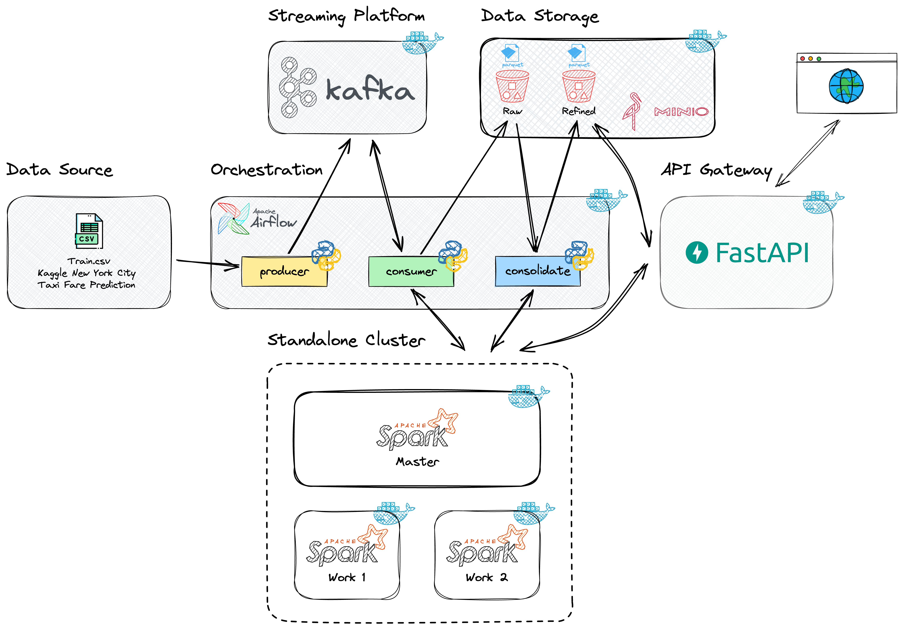

# New York City Taxi Fare

<p align="center">
    <br><br>
</p>


## 📖 About

This project implements a complete pipeline for taxi fare prediction in New York City, using an event-based data stream and a data lake for data storage and analysis.

------------
## 🧪 Technology

The project was developed with:

&rarr; <a href="https://www.python.org/" target="_blank">Python</a> <br>
&rarr; <a href="https://kafka.apache.org/" target="_blank">Apache Kafka</a> <br>
&rarr; <a href="https://airflow.apache.org/" target="_blank">Apache Airflow</a> <br>
&rarr; <a href="https://spark.apache.org/" target="_blank">Apache Spark</a> <br>
&rarr; <a href="https://fastapi.tiangolo.com/" target="_blank">Fast API</a> <br>
&rarr; <a href="https://www.docker.com//" target="_blank">Docker</a> <br>

------------
## 🔖 Proposed solution to the challenge

### 🏗️ Proposed architecture

<br><br>

### 📁 Project structure

```
taxi-fare/
│
├── dags/
│   └── taxi_raides_dag.py
├── data/
│   └── train.csv
├── docker/
│   ├── airflow.dockerfile
│   └── api.dockerfile
├── jars/
│   ├── aws-java-sdk-bundle-1.12.262.jar                
│   └── hadoop-aws-3.3.4.jar
├── src/
│   ├── api.py                
│   ├── consolidate.py                
│   ├── consumer.py                
│   ├── producer.py                
│   ├── utils.py                
├── docker-compose.yml             
├── requirements.txt               
└── README.md                      
```

------------
## 🔌 Getting started
Clone the project:

```bash
$ git clone https://github.com/GesielLopes/taxi-fare.git
```

Acess the folder and execute docker compose to run the data project:

```bash
$ cd taxi-fare

# Execute docker compose
$ docker compose up -d
```
------------
## 📕 Using the project

1. Download the train.csv file in https://www.kaggle.com/competitions/new-york-city-taxi-fare-prediction/data and save it in the data folder
2. Create buckets RAW and REFINED in minio
3. Execute dag in airflow
4. Access the API

------------
## 📕 Using the api

Accessing via terminal, with curl for example:
```bash
$ curl -X 'GET' 'http://localhost:8000/api/' -H 'accept: application/json'

$ curl -X 'GET' 'http://localhost:8000/api/?pickup_date=2011-12-13' -H 'accept: application/json'

$ curl -X 'GET' 'http://localhost:8000/api/?pickup_longitude=-73.9755630493164&pickup_latitude=40.752681732177734' -H 'accept: application/json'

$ curl -X 'GET' 'http://localhost:8000/api/?pickup_date=2011-12-13&pickup_longitude=-73.9755630493164&pickup_latitude=40.752681732177734' -H 'accept: application/json'
```

Accessing via browser. Just access via url:

    http://localhost:8000/api
    
    http://localhost:8000/api/?pickup_date=2011-12-13
    
    http://localhost:8000/api/?pickup_longitude=-73.9755630493164&pickup_latitude=40.752681732177734

    http://localhost:8000/api/?pickup_date=2011-12-13&pickup_longitude=-73.9755630493164&pickup_latitude=40.752681732177734


Accessing API Swagger via browser. Just access via url:

    http://localhost:8000/docs

------------
## 📋 TODO List

- Add an ENV file for sensitive data
- Create the project's unit tests
- Automate bucket creation
- Automate data flow in the API when refined data does not exist
- Feel free to open issues or submit pull requests for improvements or fixes

------------
## 📝 License

This project is licensed under the MIT License.